 

## 👨‍💻 About me

I enjoy turning ideas into useful digital experiences, exploring new technologies, and building systems that solve real problems.

### 🔭 Currently working on

**ShreeGen Ai Assisatant**

### 🌱 Currently learning

**AI/ML**

---

## 🧰 Languages and tools

### Languages

  

### Frameworks and libraries

  

### AI, data and databases

  

### Platforms and tools

  

<strong>View complete toolkit</strong>

 

`AWS` · `Bash` · `Chart.js` · `CSS3` · `Django` · `Docker` · `Figma` · `Firebase` · `Flask` · `Git` · `HTML5` · `JavaScript` · `Linux` · `MongoDB` · `MySQL` · `Next.js` · `OpenCV` · `Pandas` · `PostgreSQL` · `Python` · `PyTorch` · `React` · `Redis` · `Rust` · `SQLite` · `TensorFlow` · `TypeScript`

---

## 📊 GitHub activity

  

 

  

 

  

 

  

---

## 🏆 GitHub achievements

  

---

### ✨ From ideas to intelligent systems

Always learning. Always building.

  

